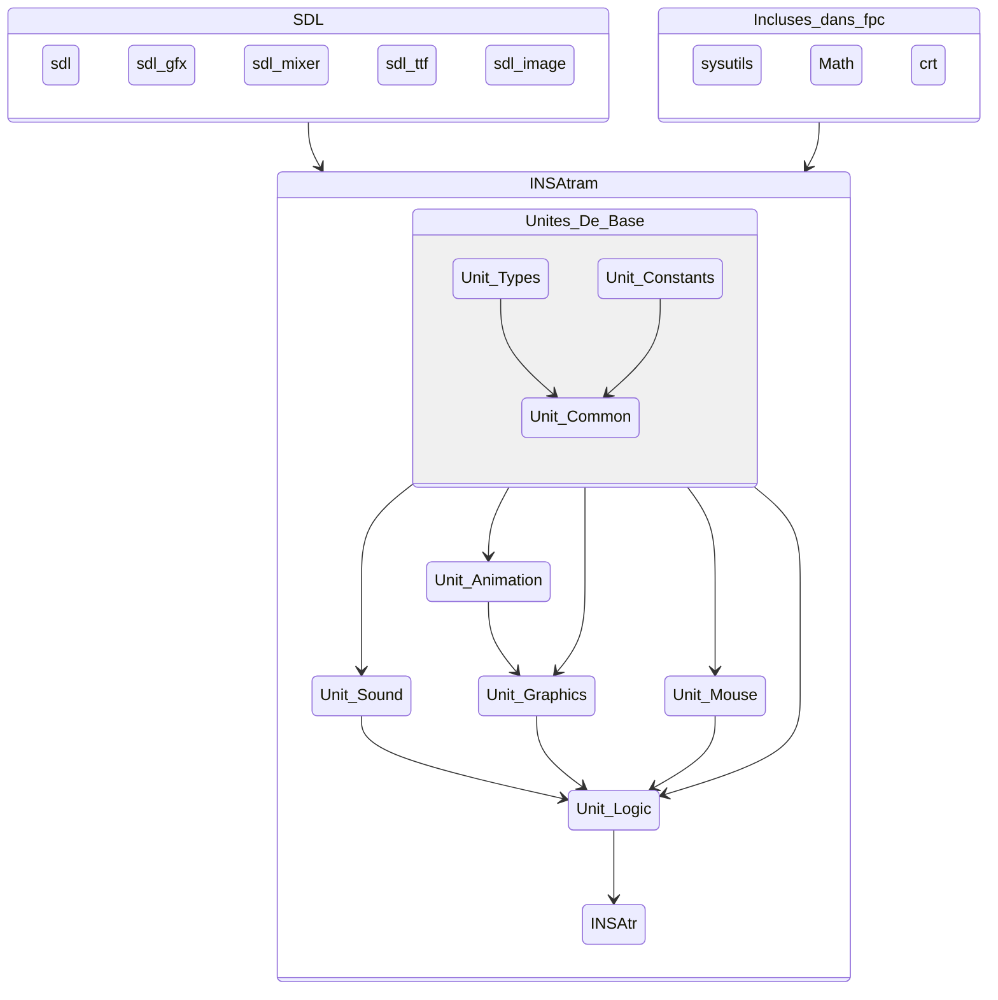

```mermaid
stateDiagram-v2


    state SDL {
        sdl
        sdl_gfx
        sdl_mixer
        sdl_ttf
        sdl_image
    }

    SDL --> INSAtram

    state Incluses_dans_fpc {
        sysutils
        Math
        crt
    }
    
    Incluses_dans_fpc --> INSAtram

    state INSAtram {

    state Unites_De_Base {

    Unit_Types --> Unit_Common
    Unit_Constants --> Unit_Common
    }

    Unites_De_Base --> Unit_Animation

    Unites_De_Base --> Unit_Graphics
    Unites_De_Base --> Unit_Logic
    Unites_De_Base --> Unit_Sound
    Unites_De_Base --> Unit_Mouse

    Unit_Animation --> Unit_Graphics

    Unit_Sound --> Unit_Logic

    Unit_Graphics --> Unit_Logic

    Unit_Mouse --> Unit_Logic

    Unit_Logic --> INSAtr

    }

```