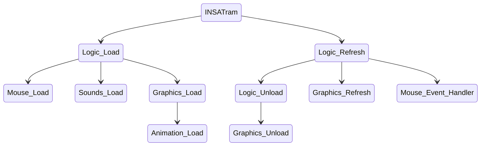

```mermaid
stateDiagram-v2
    direction TB

    INSATram --> Logic_Load
    INSATram --> Logic_Refresh

    Logic_Load --> Mouse_Load
    Logic_Load --> Sounds_Load
    Logic_Load --> Graphics_Load

    Graphics_Load --> Animation_Load

   Logic_Unload --> Graphics_Unload

Logic_Refresh --> Graphics_Refresh
  Logic_Refresh --> Logic_Unload
  Logic_Refresh --> Mouse_Event_Handler
```